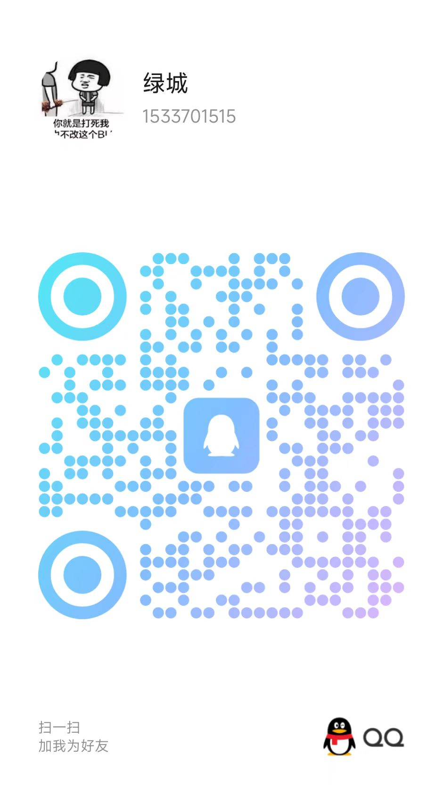

# @zh-keyboard/recognizer | 中文手写识别模块

[](LICENSE)

中文虚拟键盘组件库的手写识别模块

## 功能特点

- ✏️ 实时手写汉字识别
- 🔧 可自定义识别模型和字典
- 🚀 识别速度快，纯cpu模式200ms内，可选webgl加速
- 📚 内置支持GB2312标准中的3755个一级汉字的识别支持
- 🔄 更多文字识别支持（包括二级汉字、生僻字等）暂不开放

## 🤝 手写识别模型说明

**手写识别模型由我的一个朋友提供**

如果您需要包括二级汉字、生僻字等的更完整的手写识别模型，以及更多的定制服务，请扫描下方二维码添加我朋友的QQ进行咨询：



## 安装

```bash
# 使用npm
npm install @zh-keyboard/recognizer

# 或使用pnpm
pnpm add @zh-keyboard/recognizer
```

## 基本用法

```typescript
import { ZhkRecognizer } from '@zh-keyboard/recognizer'
// 如果需要使用WebGL后端，需要手动引入
import '@tensorflow/tfjs-backend-webgl'

// 创建识别器实例
const recognizer = new ZhkRecognizer({
  modelPath: '/models/handwrite/model.json', // TensorFlow.js模型路径
  dictPath: '/models/dict.txt', // 汉字字典路径
  backend: 'webgl' // 可选：'webgl'或'cpu'，默认为'cpu'
})

// 初始化识别器（加载模型和字典）
await recognizer.initialize()

// 使用识别器识别手写汉字
// strokeData格式：[x1, y1, isEnd1, x2, y2, isEnd2, ...]
// isEnd为0表示笔画继续，为1表示笔画结束
const strokeData = [10, 10, 0, 20, 20, 1,]
const results = await recognizer.recognize(strokeData)

// 识别结果是按置信度排序的汉字数组
console.log('识别结果:', results) // 例如 ['中', '申', '由', ...]

// 使用完毕后释放资源
await recognizer.close()
```

## 参数

- `options`: 配置对象
  - `modelPath`: 模型文件路径，指向TensorFlow.js模型的json文件
  - `dictPath`: 字典文件路径，文本文件，每行一个汉字
  - `backend`: 可选，TensorFlow.js后端类型，可选值为'webgl'或'cpu'，默认为'cpu'

## 性能优化

- 在支持WebGL的设备上使用'webgl'后端可以显著提高识别速度
- **注意：使用WebGL后端时，需要手动引入 `import '@tensorflow/tfjs-backend-webgl'`**
- 初始化时会自动进行模型预热，减少首次识别的延迟
- 如果在移动设备上使用，建议使用较小的模型以提高响应速度
